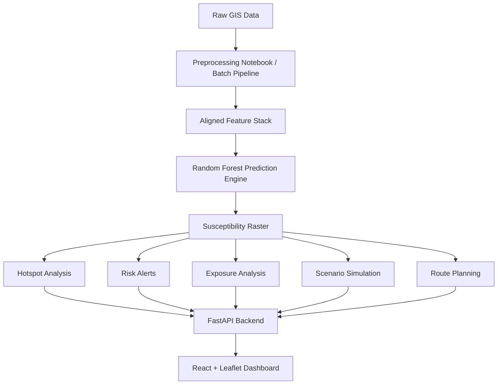

# GeoShield AI Platform Report

## 1. Current Repository Status

### What already exists

- `notebooks/phase2_preprocessing.ipynb` contains the end-to-end geospatial ML pipeline.
- The notebook currently handles:
  - raster preprocessing
  - CRS normalization
  - clipping to boundary
  - raster alignment
  - river/road distance logic
  - feature stacking
  - landslide sample extraction
  - Random Forest training
  - susceptibility raster generation
- Generated artifacts already exist in the repo:
  - `data/outputs/training_dataset.csv`
  - `data/outputs/susceptibility_map.tif`
  - `data/outputs/figures/feature_importance.png`
  - `models/random_forest.pkl`
- Two demo scripts already existed in `app/` and are now aligned to the correct repo path:
  - `app/dashboard_app.py`
  - `app/leaflet_demo.py`

### What is missing

- A production API layer
- Modular susceptibility analysis code
- Hotspot detection output as GeoJSON/API
- Explanation engine for hotspot interpretation
- Early warning API endpoint
- Route planning engine
- Infrastructure exposure analysis
- Scenario simulation engine
- A React/TypeScript/Tailwind frontend scaffold
- A clear product architecture and hackathon demo flow

### Current model metrics

- Accuracy: 0.838
- Class 0:
  - Precision: 0.863
  - Recall: 0.932
  - F1: 0.896
- Class 1:
  - Precision: 0.734
  - Recall: 0.559
  - F1: 0.635

### Technical interpretation

- The model is strong for the majority class.
- Positive-class recall is the main weakness.
- The current pipeline is good enough to power a decision-support platform, but not yet enough to stand alone as the product.

---

## 2. Product Direction

GeoShield AI should be positioned as an environmental intelligence platform, not just a classifier.

### Core product outcomes

- Risk Analysis
- Hotspot Detection
- Early Warning
- Safe Route Planning
- Infrastructure Exposure Analysis
- Scenario Simulation
- Decision Support
- Sustainability Insights

### User groups

- local governments
- disaster management teams
- urban and rural planners
- schools and hospitals
- travelers and transport operators
- community leaders

---

## 3. Proposed Architecture



### Backend layers

- Data access layer
- Raster analysis services
- Geospatial analytics services
- ML inference service
- Simulation service
- Route service
- API service

### Frontend layers

- Summary cards
- Interactive map
- Hotspot details panel
- Route planning panel
- Simulation controls
- Exposed infrastructure summary
- Warning and recommendation banners

---

## 4. Folder Structure

```text
GeoShield_Ecothon/
  app/
    dashboard_app.py
    leaflet_demo.py
  backend/
    config.py
    main.py
    schemas.py
    services/
      alerts.py
      exposure.py
      explanations.py
      raster_ops.py
      route_planner.py
      simulation.py
      susceptibility.py
  data/
    outputs/
    processed/
    raw/
  docs/
    geoshield_ai_platform_report.md
  models/
    random_forest.pkl
  notebooks/
    phase2_preprocessing.ipynb
  frontend/
    src/
      components/
      pages/
      services/
      types/
```

---

## 5. Backend Implementation

### Completed in this pass

- `backend/main.py`
  - FastAPI app
  - health endpoint
  - susceptibility summary endpoint
  - hotspot endpoint
  - top-risk endpoint
  - location alert endpoint
  - explanation endpoint
  - route planning endpoint
  - exposure summary endpoint
  - scenario simulation endpoint
- `backend/services/susceptibility.py`
  - area statistics
  - hotspot clustering
  - GeoJSON export
  - top-risk ranking
- `backend/services/explanations.py`
  - human-readable hotspot explanation builder
- `backend/services/alerts.py`
  - risk level classification
  - recommendation generation
- `backend/services/route_planner.py`
  - road graph builder
  - Dijkstra
  - A*
- `backend/services/exposure.py`
  - infrastructure exposure counts
- `backend/services/simulation.py`
  - scenario raster adjustment
  - comparison logic

### Notes

- The current route planner is a functional scaffold and should be refined once a clean road graph dataset is available.
- Exposure analysis is currently counting available layers and should be upgraded to true raster-vector overlay metrics.
- Simulation currently applies scenario perturbations to the aligned feature stack; this is the right hackathon MVP pattern.

---

## 6. API Specification

### `GET /health`
Returns service and asset availability.

### `GET /analysis/summary`
Returns area statistics for risk bands.

Example response:

```json
{
  "total_area": 12345.6,
  "very_low_risk_area": 123.4,
  "low_risk_area": 456.7,
  "moderate_risk_area": 789.0,
  "high_risk_area": 321.0,
  "very_high_risk_area": 98.7,
  "very_low_risk_percentage": 10.0,
  "low_risk_percentage": 20.0,
  "moderate_risk_percentage": 30.0,
  "high_risk_percentage": 25.0,
  "very_high_risk_percentage": 15.0
}
```

### `GET /analysis/hotspots`
Returns hotspot clusters above the threshold.

### `GET /analysis/top-risk`
Returns the top 10 highest-risk coordinates.

### `GET /alerts/location?lat=&lon=`
Returns risk class and recommendation.

### `GET /explanations/hotspot`
Returns a human-readable explanation.

### `POST /routes/plan`
Returns shortest and safest route comparisons.

### `GET /exposure/summary`
Returns exposed infrastructure counts.

### `POST /simulation`
Returns old vs new susceptibility outcomes under modified environmental variables.

---

## 7. Database / Storage Schema

A lightweight geospatial-first design is enough for the hackathon.

### Recommended storage

- PostgreSQL + PostGIS for future expansion
- GeoJSON and GeoTIFF files for MVP
- CSV for model training snapshots

### Suggested tables

#### `analysis_runs`
- `id`
- `run_name`
- `created_at`
- `scenario_json`
- `model_version`
- `source_raster_path`
- `output_raster_path`

#### `hotspots`
- `id`
- `run_id`
- `hotspot_id`
- `geometry`
- `centroid_latitude`
- `centroid_longitude`
- `area`
- `mean_risk`
- `max_risk`
- `explanation`

#### `risk_alerts`
- `id`
- `location_name`
- `lat`
- `lon`
- `risk_score`
- `risk_level`
- `recommendation`

#### `exposed_assets`
- `id`
- `asset_type`
- `geometry`
- `exposure_score`
- `risk_zone`

#### `route_requests`
- `id`
- `source_lat`
- `source_lon`
- `destination_lat`
- `destination_lon`
- `shortest_distance`
- `safest_distance`
- `risk_reduction`

---

## 8. GIS Processing Workflow

1. Load raw raster and vector inputs.
2. Reproject all layers to EPSG:4326.
3. Clip everything to the district boundary.
4. Align rasters to the DEM grid.
5. Convert roads/rivers to distance rasters.
6. Stack all aligned predictors.
7. Sample landslide and non-landslide points.
8. Train the model.
9. Predict susceptibility raster.
10. Generate hotspot layers and risk summaries.

---

## 9. Route Planning Workflow

1. Convert road network into a graph.
2. Assign edge cost as:

```text
cost = distance + (risk_weight × susceptibility)
```

3. Run Dijkstra for the shortest path.
4. Run A* for the safest path.
5. Compare distance, risk, and travel time.
6. Render both routes on the map.

---

## 10. Simulation Workflow

1. Start from the existing feature stack.
2. Apply user-controlled scenario multipliers.
3. Recompute the susceptibility raster.
4. Detect new hotspots.
5. Compare high-risk area change.
6. Compare hotspot growth.
7. Show before/after map and metrics.

---

## 11. MVP for ECOTHON 2026

### Must-have

- susceptibility map
- hotspot detection
- click-to-explain hotspot panel
- early warning score lookup
- basic safe route vs shortest route comparison
- rainfall scenario slider
- exposure summary for roads and settlements
- polished map dashboard

### Nice-to-have

- bridge/school/hospital overlays
- scenario comparison charts
- downloadable GeoJSON and PDF summary
- simple admin mode for area selection

---

## 12. Advanced Version

- live rainfall integration
- mobile-friendly field view
- PostGIS persistence
- user authentication
- alert subscriptions
- multi-hazard support
- road closure awareness
- evacuation routing
- temporal change detection
- ensemble ML models
- calibrated probability thresholds
- explainable AI overlays

---

## 13. Hackathon Demo Flow

1. Show the current susceptibility map.
2. Click a hotspot and show explanation.
3. Run hotspot analytics and show top-risk locations.
4. Plan a route between two points and compare safest vs shortest.
5. Increase rainfall by 30 percent.
6. Re-run the scenario simulation.
7. Show how high-risk area and hotspot count expand.
8. Summarize sustainability and resilience impact.

---

## 14. Current Gaps To Close Next

- Build the React frontend scaffold.
- Connect the frontend to the FastAPI endpoints.
- Improve route planning with a proper road graph dataset.
- Add true infrastructure overlay analysis.
- Add persistence for analysis runs and hotspot history.
- Add scenario presets for demo mode.

---

## 15. Recommended Next Engineering Step

Create the frontend app around the new API and then wire the dashboard to:

- `/analysis/summary`
- `/analysis/hotspots`
- `/alerts/location`
- `/routes/plan`
- `/simulation`
- `/exposure/summary`

That is the fastest path from model to platform.
